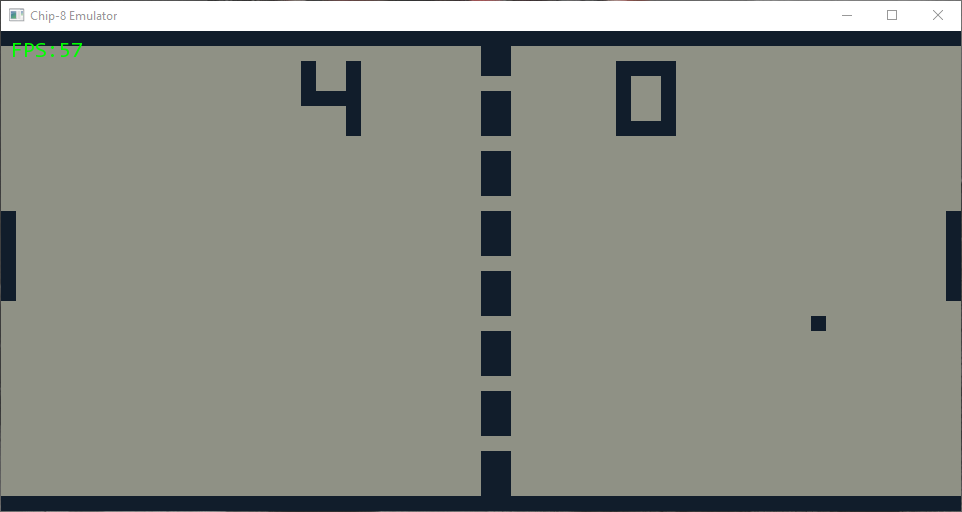

# chip-eight-cs
A basic CHIP-8 emulator written in C#



I tried to do a basic performance benchmark so that if I port this to `C/C++` I have something to compare with:

```cs
var sw = new Stopwatch();
sw.Start();

var counter = 5550000;
for (int x = 0; x < 10; x++) {
  for (int i = 0; i < counter; i++) {
    Execute();

    // count down delay timer (relies on 60Hz rate)
    if (Registers.DT > 0)
      Registers.DT--;

    // count down sound timer (relies on 60Hz rate)
    if (Registers.ST > 0) {
      var msToBeep = (int)Math.Ceiling(Registers.ST * Consts.MillisecondsPerFrame);
      Registers.ST = 0;
      Sound.Beep(msToBeep); // f&f beep in bg
    }
  }

  Debug.WriteLine(sw.ElapsedMilliseconds);
  sw.Restart();
}
```

Output:
> 1161
1014
1004
998
1002
995
1000
1000
1003
998
997
1014

Running the `INVADERS` intro loop on my i7-9750H it performs ~5.55 million cpu cycles in ~1000 ms (while debugging). It is 9 cycles per frame, so that is ~616,666 fps.
